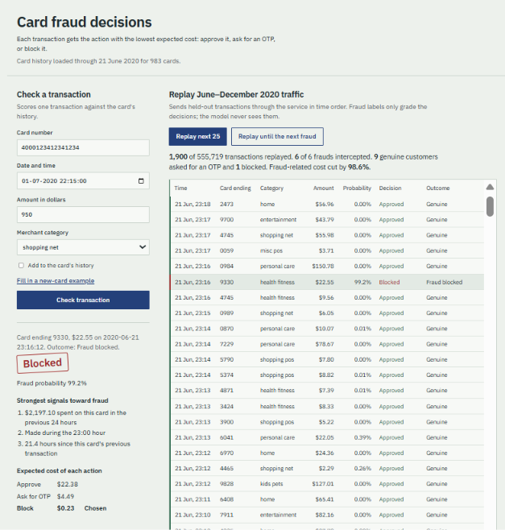

# Credit Card Fraud Detection

An end-to-end fraud decision system for card transactions. For every transaction it estimates the probability of fraud from the card's recent behavior, chooses the cheapest action (approve, ask for an OTP, or block), explains why in plain language, and serves all of this through a FastAPI service with a demo page that replays held-out transactions.

The project goes beyond model accuracy: it uses leak-free time-based evaluation, tests that real-time features match training features, and makes decisions by the money at stake rather than a fixed score cutoff.



> **Data note:** the data is simulated (Sparkov generator, via Kaggle). Results show that the method works, not how it would perform on a real bank's data, where performance would be substantially lower.

---

## Results

Evaluated **once** on a held-out test set: 555,719 transactions from June to December 2020. The model was trained on 2019 data, and every design decision was made on a separate validation period (January to June 2020). The evaluation plan was written down before the test set was opened.

| Metric | Test result |
|---|---|
| PR-AUC | 0.962 (random baseline: 0.004) |
| Precision at 80% / 90% recall | 98.8% / 92.3% |
| Fraud intercepted (OTP or block) | 96.3% |
| Genuine transactions with any friction | 0.40% (1 in 250) |
| Genuine transactions blocked | 0.05% (1 in about 1,970) |
| Fraud-related cost vs approving everything | −97.6% ($1,133,325 → $26,712) |
| Recall on a card's first fraud | 86.9% (vs 97.4% for later frauds) |

The model's probabilities stayed **calibrated** on the test period even though fraud was 37% rarer there (0.386% vs 0.615% in validation). The decision policy depends on that.

### How the model improved (validation PR-AUC)

| Step | PR-AUC |
|---|---|
| Logistic regression on amount, category, hour | 0.438 |
| + per-card history features (same model) | 0.697 |
| XGBoost with the same features | 0.976 |

### Decision policy: amount-aware vs fixed thresholds

| | Validation cost | Test cost | Genuine customers hassled (test) |
|---|---|---|---|
| Fixed score thresholds (tuned on validation) | $22,991 | $30,815 | 3,158 |
| **Expected-cost rule (no tuning)** | **$21,076** | **$26,712** | **2,214** |

The expected-cost rule approves slightly more frauds by count, but they are small ones, so the bank loses less money and inconveniences about 30% fewer genuine customers. It also beat the thresholds under every alternative cost assumption tested.

---

## How it works

```text
OFFLINE: training and evaluation
  fraudTrain.csv ─► add_features() ─► time-based split ─► XGBoost ─► calibration check
                                                             ├─► SHAP analysis
                                                             └─► expected-cost policy (models/policy.json)

ONLINE: serving
  POST /score ─► validate input ─► CardHistoryStore ─► features ─► XGBoost ─► expected costs
                                    (seeded from history,                        │
                                     updated per transaction)          guardrail ─► SHAP reasons ─► JSON

  tests/test_serving.py proves CardHistoryStore produces exactly the same features as add_features()
```

### Features

Every feature uses only transactions **before** the current one, so each value is exactly what a bank could compute at that moment.

| Feature | Meaning |
|---|---|
| `amt` | Transaction amount |
| `amt_vs_card_avg` | Amount relative to the card's average spend so far |
| `amt_sum_1h`, `amt_sum_24h` | Card's spending in the previous hour and day |
| `txn_count_1h`, `txn_count_24h` | Card's transaction count in the previous hour and day |
| `hours_since_prev` | Time since the card's previous transaction |
| `hour` | Hour of day |
| `category` | Merchant category |

Excluded on purpose: names, street, card number (used only to look up history), gender and age (fairness), and past fraud labels (banks learn labels weeks later through disputes).

### Decision rule

For fraud probability *p* and amount *a*, each action's expected cost is:

```text
approve:  p × a
otp:      p × 0.2 × a  +  (1 − p) × $2
block:    (1 − p) × $30
```

The cheapest action wins. As a result, the risk needed to act falls as the amount rises:

| Amount | OTP when probability is above | Block when above |
|---|---|---|
| $20 | 11.1% | 87.5% |
| $100 | 2.4% | 58.3% |
| $1,000 | 0.25% | 12.3% |

A guardrail never auto-approves amounts above the largest amount seen in training, because tree models have no data there.

---

## Key design decisions

**Time-based splits, not random.** Training on 2019, validating on early 2020, and testing on late 2020 mirrors production, where a model always predicts transactions that come after its training data. A random split lets the model see a card's future.

**Leakage was tested, not assumed.** A truncation test rebuilds features after deleting all later data; no feature value changed. A deliberately leaky feature fails the same test, proving the test can catch leakage.

**PR-AUC and dollars, not accuracy.** At under 1% fraud, a model that never flags anything scores over 99% accuracy.

**XGBoost, unweighted.** Fraud here is a combination of signals (large amount relative to the card's history, during a spending spree, late at night), which trees capture directly. Class weighting gave no improvement and distorted probabilities, so it wasn't used. SMOTE wasn't used because interpolating between different cards' histories would create behavior that can't exist.

**Explanations with SHAP.** XGBoost's built-in TreeSHAP gives exact per-feature contributions that add up to each prediction (checked in notebook 06). The API turns them into sentences such as "$1,813.83 spent on this card in the previous 24 hours."

**Tested and rejected.** Customer-to-merchant distance showed no signal (median 78.2 km for both fraud and genuine) and was dropped. Fixed thresholds were replaced after SHAP analysis revealed they blocked small genuine purchases while approving a $950 fraud.

---

## Project structure

```text
credit-card-fraud-detection/
├── api/
│   ├── app.py               FastAPI service: scoring, demo replay, demo page
│   └── static/index.html    Demo page
├── data/raw/                Kaggle CSVs (not committed)
├── docs/demo.png            Screenshot for this README
├── models/
│   ├── policy.json          Decision rule and cost assumptions
│   ├── metadata.json        Training details, categories, library versions
│   └── *.joblib             Trained models (not committed)
├── notebooks/               Analysis, in order 01–09
├── reports/test_metrics.json  Final test-set numbers
├── src/
│   ├── data.py              Load and split by time
│   ├── features.py          Offline feature engineering and feature list
│   ├── explain.py           SHAP values and reason sentences
│   ├── policy.py            Decision rules and cost accounting
│   ├── serving.py           Real-time per-card history store
│   └── train.py             Reproducible training script
└── tests/                   13 tests: feature consistency and API behavior
```

---

## Quick start

Tested with Python 3.9.9, pandas 2.3.3, scikit-learn 1.6.1, and xgboost 2.1.4.

```bash
git clone https://github.com/Santosh-S321/credit-card-fraud-detection.git
cd credit-card-fraud-detection
python -m venv .venv
# Windows: .venv\Scripts\activate    macOS/Linux: source .venv/bin/activate
pip install -r requirements.txt
```

`requirements.txt` was generated on Windows. On macOS or Linux, remove Windows-only packages such as `pywin32` if installation fails.

**Download the data** (needs a Kaggle API token):

```bash
kaggle datasets download -d kartik2112/fraud-detection -p data/raw --unzip
```

**Train, test, and run:**

```bash
python -m src.train              # trains models/xgb_deploy.joblib, a few minutes
python -m pytest tests -v        # 13 tests
uvicorn api.app:app              # then open http://127.0.0.1:8000
```

API documentation is at http://127.0.0.1:8000/docs.

**Reproduce the analysis:** run the notebooks in order. Notebook 04 trains the evaluated model, 05 and 07 build the decision policy, 08 runs the one-time test evaluation, and 09 checks the deployment model for bugs.

---

## API

| Method | Path | Purpose |
|---|---|---|
| `GET` | `/` | Demo page |
| `GET` | `/health` | Service status, history coverage, categories |
| `POST` | `/score?record=true` | Score one transaction; `record=false` checks without changing card history |
| `GET` | `/demo/status` | Replay progress and running totals |
| `POST` | `/demo/replay?n=25&until_fraud=false` | Replay held-out transactions in time order |

**Example request.** Send card numbers as strings: some are 19 digits, which JavaScript clients silently round.

```json
{
  "cc_num": "4000123412341234",
  "trans_date_trans_time": "2020-07-01T22:15:00",
  "amt": 620.33,
  "category": "entertainment"
}
```

**Example response** (the `features` object is omitted here):

```json
{
  "fraud_probability": 0.999843,
  "action": "block",
  "expected_costs": { "approve": 620.23, "otp": 124.05, "block": 0.0 },
  "guardrail_applied": false,
  "recorded": false,
  "reasons": [
    { "feature": "amt", "text": "Amount $620.33", "contribution": 5.1 },
    { "feature": "amt_sum_24h", "text": "$1,813.83 spent on this card in the previous 24 hours", "contribution": 3.2 },
    { "feature": "amt_sum_1h", "text": "$780.52 spent on this card in the previous hour", "contribution": 1.4 }
  ]
}
```

Contribution values above are illustrative. Status codes: `422` invalid input or unknown category, `409` transaction earlier than the card's latest recorded transaction.

---

## Limitations

- **Simulated data.** The generator produces cleaner fraud patterns than reality, which is why raw amount matters so much to the model. Real performance would be lower.
- **Cost figures are assumptions:** $2 OTP friction, $30 block friction, 80% OTP effectiveness. Results held across the alternative assumptions tested, but a real bank would measure these.
- **A card's first fraud is harder to catch** (86.9%) because the model relies heavily on spending-spree signals that only appear after fraud begins.
- **Small frauds are deliberately allowed through** when an OTP would cost more than the expected loss. In practice, small "card testing" charges often precede larger fraud.
- **In-memory history store.** Card history is rebuilt from the CSV at startup and works in a single process. Production would use a shared store such as Redis.
- **The guardrail covers amounts only.** Other out-of-range inputs, such as a transaction years after a card's last activity, still go straight to the model.

## Future work

- Monitor calibration and fraud rate over time, and retrain on a schedule.
- Add features for the first transaction in a spree (for example, new merchant for this card).
- Upgrade from Python 3.9, which reached end of life in October 2025; retrain and rerun the tests after upgrading.
- Move card history to Redis to support multiple API workers.
- Containerize with Docker and host a live demo.

---

## Data

[Credit Card Transactions Fraud Detection Dataset](https://www.kaggle.com/datasets/kartik2112/fraud-detection) on Kaggle (CC0: public domain), generated with the [Sparkov Data Generation](https://github.com/namebrandon/Sparkov_Data_Generation) tool. Simulated transactions from January 2019 to December 2020.